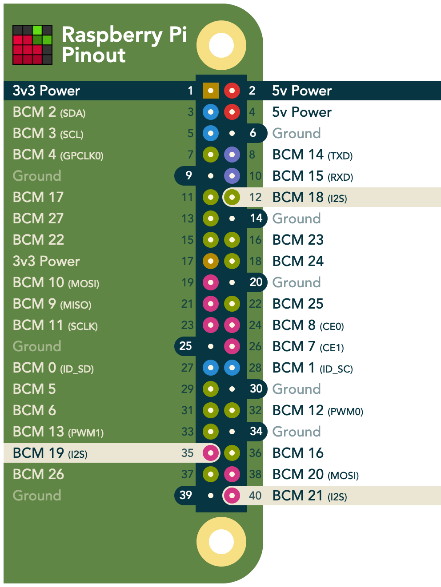
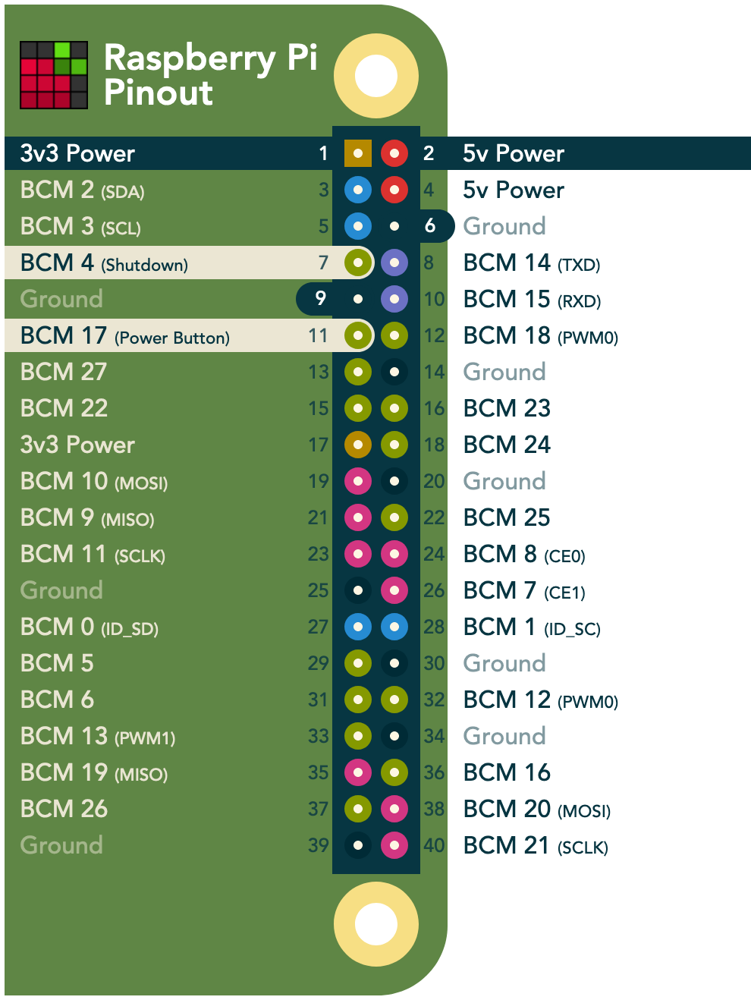
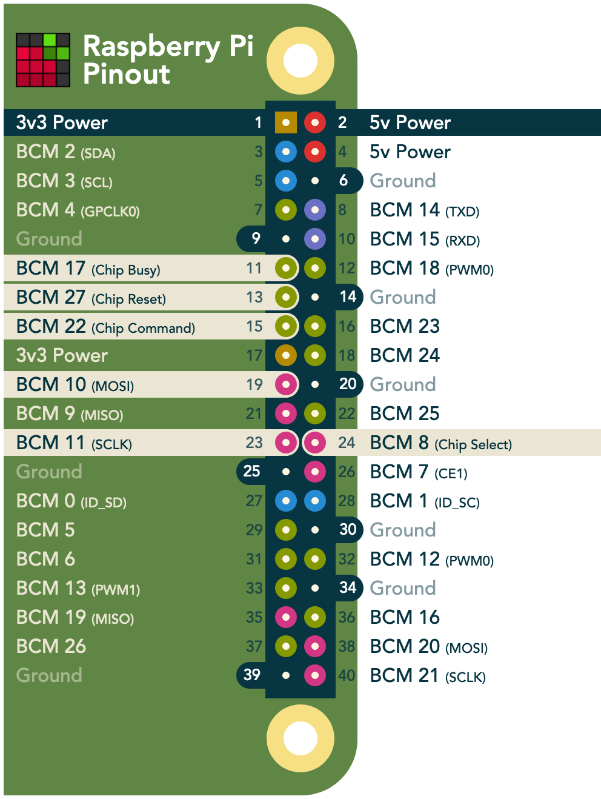
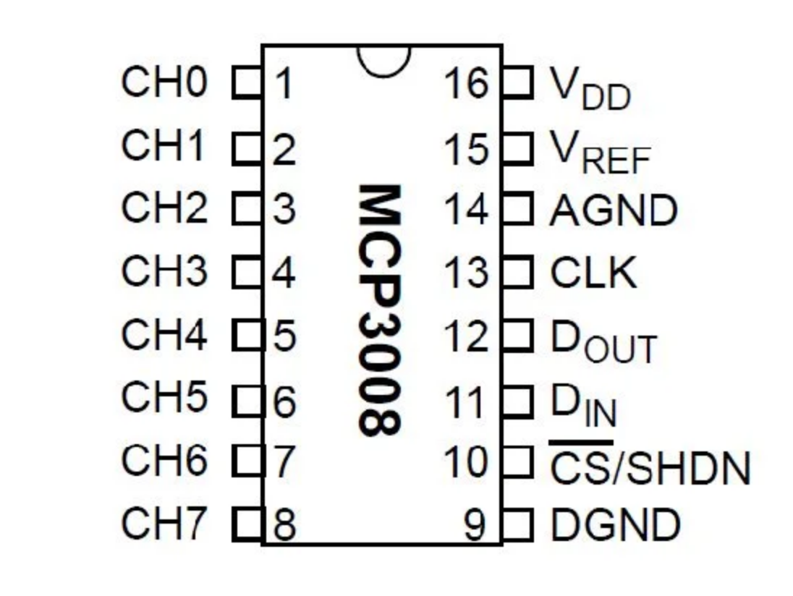

# Retro Radio


A internet radio based on a Raspberry Pi 3A+, using a Speaker Bonnet, an EInk display and the OnOff-Shim. I reused the old analogue volume control and on-off switch potentiometer. The sound comes from two different speakers to get the left and right channel and a wider sound frequence.

Setting the EInk display takes some time. Especially the shutdown isn’t the fastest as I used a display with color and that takes some extra time, but it doesn’t hurt while turning it off and walking away. It enabled me to have a nice off-message.

## Speed up Raspbian boot

### Update, install vim and configure Pi

```
sudo apt update
sudo apt upgrade
sudo apt install vim
sudo raspi-config
```

### Boot config

Adjust the `/boot/config.txt` with the following (edit or add):

```
# Disable the rainbow splash
disable_splash=1

# Set bootloader delay to 0 seconds. Default is 1.
boot_delay=0
```

Make the kernel output less verbose by appending the following after `rootwait` in `/boot/cmdline.txt`:

```
loglevel=3 quiet logo.nologo
```

### Static IP

Define a static IP for your Pi in your router. Fritzbox makes this quite easy. Then tell the Pi to use that IP always. Edit `/etc/dhcpcd.conf` with these lines:

```
interface wlan0
static ip_address=192.168.178.178/24
static routers=192.168.178.1
static domain_name_servers=192.168.178.1 8.8.8.8

noarp
ipv4only
noipv6
```

### Disable services

Disable services that take up start time but are not needed. Check with `systemd-analyze` how long it takes to boot and identify with `systemd-analyze blame` which services take a lot of time.

```sh
sudo systemctl disable ntp.service
sudo systemctl disable dphys-swapfile.service
sudo systemctl disable keyboard-setup.service
sudo systemctl disable apt-daily.timer
sudo systemctl disable apt-daily-upgrade.timer
sudo systemctl disable wifi-country.service
sudo systemctl disable hciuart.service
sudo systemctl disable raspi-config.service
sudo systemctl disable avahi-daemon.service
sudo systemctl disable triggerhappy.service
sudo systemctl disable rpi-eeprom-update.service
sudo systemctl disable aplay.service
```

## Prepare deployment

Install the GPIO zero library and vlc:

```sh
sudo apt install python3-gpiozero vlc python3-vlc python3-pip
```

Install Bluetooth player required packages:

```sh
sudo apt install alsa-utils bluez bluez-tools pulseaudio-module-bluetooth python3-gst-1.0 gstreamer1.0-pulseaudio gstreamer1.0-tools gstreamer1.0-alsa gstreamer1.0-plugins-base gstreamer1.0-plugins-good gstreamer1.0-plugins-bad
```

## Connect Adafruit Speaker Bonnet

Follow [the guide](https://learn.adafruit.com/adafruit-speaker-bonnet-for-raspberry-pi?view=all) to assamble, connect and setup the Adafruit Speaker Bonnet ([PDF](docs/adafruit-speaker-bonnet.pdf)). Make sure to NOT install the white noise as this makes problems with the playback.

See the [pinouts](https://pinout.xyz/pinout/speaker_bonnet#) to connect:



## Connect buttons

Use two buttons for next and previous station and connect those to pins 5 and 6 and any free ground.

## OnOff Shim

Connect the [OnOff Shim](https://shop.pimoroni.com/products/onoff-shim) to the Pi and install the software with this command:

```sh
curl https://get.pimoroni.com/onoffshim | bash
```

Edit `/etc/cleanshutd.conf` to this content:

```
daemon_active=1
trigger_pin=23
#led_pin=17
poweroff_pin=4
hold_time=1
shutdown_delay=0
polling_rate=1
```

See the [pinouts](https://pinout.xyz/pinout/onoff_shim#) to connect. Note that we switched the trigger pin to 23 as the 17 is used by the Inky pHAT.



Edit `/usr/bin/cleanshutd`:

Find the block that starts with `if shutdown_trigger; then` in line ~85 and make sure it looks like this, calling our custom display-off-message:

```
echo $msg
wall $msg
/home/pi/display-off-message
wait
daemon="off"
shutdown -h +$shutdown_delay
```

As I have an old button for this that keeps its state when turned on, I have a modified `cleanshutd` in this repo. Adjust according to your hardware.

## Inky pHAT

Connect the [Inky pHAT](https://shop.pimoroni.com/products/inky-phat?variant=12549254217811) to the Pi and install the software with this command:

```sh
curl https://get.pimoroni.com/inky | bash
```

See the [pinouts](https://pinout.xyz/pinout/inky_phat#) to connect:



## Volume control

I have an old potentiometer and needed an Analoge-Digital-Converter as the Raspberry only supports digital pins. I’ve used a `MCP3008` ADC which should be connected like described [here](https://www.digikey.com/en/maker/projects/raspberry-pi-analog-to-digital-converters/72388f5f1a0843418130f56c53a1276c). As the PINs described in the tutorial there are already in use in this project, I connected the PINs like this:



```
MCP3008 VDD to Raspberry Pi 3.3V
MCP3008 VREF to Raspberry Pi 3.3V
MCP3008 AGND to Raspberry Pi GND
MCP3008 DGND to Raspberry Pi GND
MCP3008 CLK to Raspberry Pi pin 13
MCP3008 DOUT to Raspberry Pi pin 25
MCP3008 DIN to Raspberry Pi pin 9
MCP3008 CS/SHDN to Raspberry Pi pin 26
MCP3008 CH0 to Potentiometer
```

Additionally connect the potentiometer to 3.3V and ground from the Raspberry Pi.
Install the python module:

```
pip3 install adafruit-mcp3008
```

## Deploy

Copy everything on the Raspi:

```
scp *.py pi@192.168.178.178:/home/pi/
scp stations.csv pi@192.168.178.178:/home/pi/
scp display-off-message pi@192.168.178.178:/home/pi/
scp assets/*.png pi@192.168.178.178:/home/pi/assets/
scp fonts/* pi@192.168.178.178:/home/pi/fonts
```

### Create the service:

```
sudo systemctl edit --force --full retro-radio
```

Copy the contents from the `retro-radio.service` in there and save.

```
sudo systemctl enable retro-radio
```